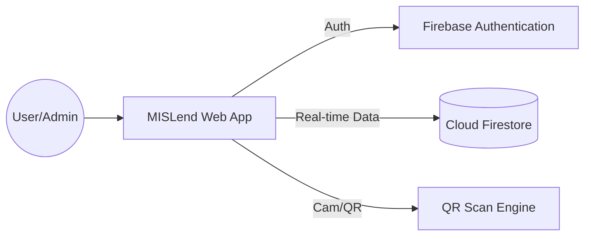

# 🛰️ MISLend: Smart Equipment Management System

,

**MISLend** is a professional, high-performance web application designed for the **UCC MIS Department** to streamline the borrowing and returning of technical equipment. Built with a focus on ease of use, security, and administrative control, it leverages Firebase for real-time data and authentication.

---

## 🏗️ Architecture Overview

MISLend follows a serverless architecture pattern:
- **Frontend**: A responsive SPA (Single Page Application) built with modern CSS and Vanilla JS.
- **Backend-as-a-Service (BaaS)**: Google Firebase powers the entire backend lifecycle.
- **Data Flow**: The frontend communicates directly with Firestore for real-time updates and uses Firebase Auth for secure session management.

---

## ✨ Key Features

- **Student Account Approval**: Robust registration flow where new students are "Pending" until verified by an admin.
- **QR Code Integration**: Scan equipment for instant borrowing and returning (requires HTTPS).
- **Dashboard Analytics**: Real-time stats on available equipment, active borrows, and overdue items.
- **Automated Logging**: Full transaction history with return condition tracking (Good/Damaged).
- **Modern Responsive UI**: Premium design with smooth animations and a focus on UX.

---

## 🛠️ Technology Stack

- **Frontend**: JavaScript (ES6+), CSS3 (Flexbox/Grid), HTML5 (Semantic).
- **Backend**: Firebase Firestore (NoSQL), Firebase Authentication.
- **Tooling**: VS Code, Git/GitHub, Netlify/Firebase Hosting.

---

## 🚀 Quick Setup Guide

### 1. Firebase Project Creation
1. Go to the [Firebase Console](https://console.firebase.google.com/).
2. Create a new project.
3. Enable **Authentication** (Email/Password).
4. Create a **Firestore Database** in **Test Mode**.

### 2. Connect Your App
1. Register a **Web App** in Firebase.
2. Open `app.js` and paste your `firebaseConfig`.

### 3. Initialize Admin Account
1. Register a new account.
2. In **Firestore Console > users collection**, set your user's:
   - `role`: `"admin"`
   - `status`: `"approved"`

---

## 🏗️ Database Schema

### `users`
| Field | Type | Description |
| :--- | :--- | :--- |
| `name` | String | User's full name |
| `email` | String | Institutional email |
| `role` | String | `"student"` or `"admin"` |
| `status` | String | `"pending"` or `"approved"` |
| `studentId`| String | (Optional) 10-digit School ID |

### `equipment`
| Field | Type | Description |
| :--- | :--- | :--- |
| `equipmentId`| String | Unique hardware ID |
| `name` | String | Item name |
| `status` | String | `"available"`, `"borrowed"`, or `"maintenance"` |

---

## 🔐 Security & Access Control

- **Pending Logic**: New students are restricted until admin approval.
- **Role Guards**: Admin-only pages are protected by client-side checks and Firestore security rules.
- **QR Scanning**: Requires `localhost` or `HTTPS` for browser camera access.

---

## 🧹 Maintenance

> [!IMPORTANT]
> **Account Removal**: Deleting a user in the MISLend Dashboard removes their Firestore data. To fully remove the account, you must also delete their email in the **Firebase Console > Authentication** tab.

---

*This project is maintained for the UCC MIS Office.*