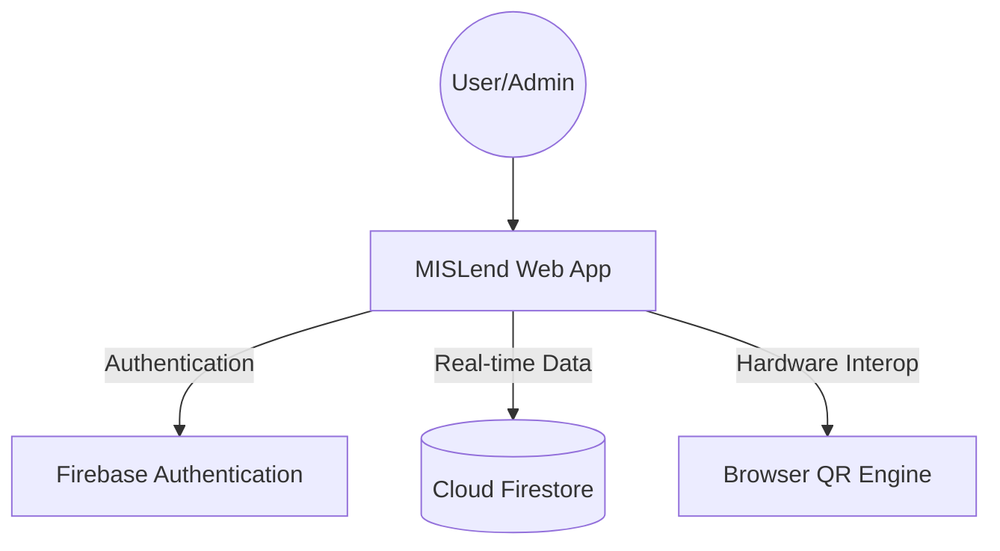

# 🛰️ MISLend: Smart Equipment Management System


**MISLend** is a professional, high-performance web application designed for the **UCC MIS Department** (University of Caloocan City - Management Information Systems) to streamline the process of borrowing and returning technical equipment. 

Built with a focus on ease of use, security, and administrative control, it leverages **Firebase** for real-time data synchronization and secure authentication, replacing traditional paper-based logs with a modern QR-driven solution.

---

## 🏗️ Architecture Overview

MISLend follows a modern serverless architecture pattern:
- **Frontend**: A responsive Single Page Application (SPA) built with Vanilla JavaScript (ES6+), CSS3 (Flexbox/Grid), and Semantic HTML5.
- **Backend-as-a-Service (BaaS)**: Powered by **Google Firebase**.
- **Data Flow**: The frontend communicates directly with **Cloud Firestore** for real-time updates and uses **Firebase Auth** for secure session management.



---

## ✨ Key Features

### 👨‍🎓 For Students
- **Instant QR Borrowing**: Scan physical QR codes on equipment for immediate tracking.
- **Real-time Availability**: Browse available projectors, laptops, networking kits, and more.
- **Personal Dashboard**: Track your current borrows, history, and return deadlines.
- **Simple Returns**: Hand back equipment and log it in seconds with condition reporting (Good/Damaged).

### 👨‍🏫 For Professors
- **Dedicated Dashboard**: Optimized workflow for faculty members.
- **Equipment Reservation**: Ensure tools are ready for classroom sessions.

### 👩‍💼 For Administrators
- **Account Approval**: Verify and approve student registrations before they can borrow.
- **Live Inventory Tracking**: Real-time counts of total, borrowed, and maintenance items.
- **QR Generation**: Generate and download unique QR codes for new hardware directly from the dashboard.
- **Automated Logging**: Export full transaction history to Excel/CSV for institutional audits.
- **Maintenance Queue**: Flag damaged items for repair and track their status.

---

## 🛠️ Technology Stack

| Layer | Technology |
| :--- | :--- |
| **Frontend** | JavaScript (ES6+), CSS3, HTML5 |
| **Styles** | Vanilla CSS (Modern UI/UX with smooth animations) |
| **Backend** | Firebase Firestore (NoSQL) |
| **Auth** | Firebase Authentication (Email/Password) |
| **Icons** | Font Awesome 6.5.0 |
| **Fonts** | Sora, DM Sans (Google Fonts) |
| **Hosting** | Netlify / Firebase Hosting |

---

## 🚀 Quick Setup Guide

### 1. Firebase Configuration
1. Create a project in the [Firebase Console](https://console.firebase.google.com/).
2. Enable **Authentication** with the Email/Password provider.
3. Create a **Cloud Firestore** database.
4. Register a **Web App** and copy your `firebaseConfig` object.

### 2. Connect the App
Open `assets/js/app.js` and paste your configuration:
```javascript
const firebaseConfig = {
  apiKey: "YOUR_API_KEY",
  authDomain: "YOUR_PROJECT.firebaseapp.com",
  projectId: "YOUR_PROJECT_ID",
  storageBucket: "YOUR_PROJECT.appspot.com",
  messagingSenderId: "YOUR_ID",
  appId: "YOUR_APP_ID"
};
```

### 3. Initialize Admin Access
1. Register a new account via the app's `register.html`.
2. Go to the **Firestore Console > users collection**.
3. Locate your user document and set:
   - `role`: `"admin"`
   - `status`: `"approved"`

---

## 🔐 Security & Access Control

- **Pending Logic**: New student accounts are restricted from borrowing until verified by an Administrator.
- **Role Routing**: System guards prevent unauthorized access to Admin and Professor dashboards.
- **HTTPS Requirement**: The QR scanner requires a secure context (HTTPS or localhost) to access the device camera.

---

## 🧹 Maintenance & Logging

> [!IMPORTANT]
> **Data Integrity**: Deleting a user in the MISLend Dashboard removes their Firestore record. To comply with security best practices, you must also manually delete their entry in the **Firebase Console > Authentication** tab to fully terminate access.

> [!TIP]
> **Exports**: Always export your monthly logs using the "Export to Excel" button in the Admin Logs section for offline backup and reporting.

---

## 👥 Project Credits

Developed with ❤️ by **BSCS 1A Students** of the **University of Caloocan City**.

*This project is maintained for the UCC MIS Office.*